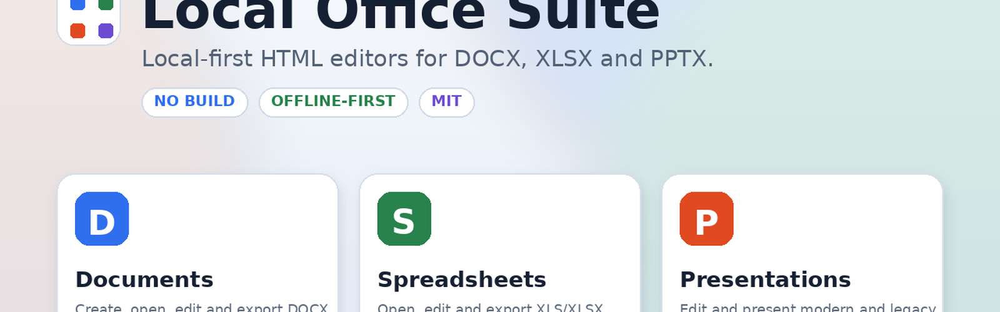

<p align="center">
  
</p>

# InkDesk

> **The lightweight local-first productivity suite.**

InkDesk is an open-source, browser-native suite for focused DOCX, XLS/XLSX, and PPTX workflows. It is distributed as static HTML, CSS, and JavaScript, processes documents inside the current browser context, and does not require a project-operated backend.

**Project status: Beta (`0.19.0-beta`).** Compatibility with advanced Microsoft Office features is partial. InkDesk does not claim complete Microsoft Office fidelity.

## Workspaces

| Workspace | Formats | Current focus |
|---|---|---|
| Documents | DOCX | Basic editing, formatting, images, tables, lists, headers/footers, and package-preserving copy export |
| Spreadsheets | XLS import; XLSX open/save | BIFF8 import, values, cached formulas, styles, images, worksheet editing, and XLSX copy export |
| Presentations | PPTX | Basic slide editing, images, layouts, presentation mode, and package-preserving copy export |

## Privacy and offline operation

Core processing is local. InkDesk has no accounts, telemetry, analytics, mandatory cloud synchronization, or remote document-processing API. Runtime libraries are bundled in `shared/vendor/`. The optional service worker caches only same-origin application assets when the project is served over HTTP(S); it is skipped under `file://`.

## Quick start

Serve the repository with any static server:

```bash
python3 -m http.server 8080
```

Open `http://localhost:8080/`. Compatible local-file or embedded hosts may open `index.html` directly. Saving creates a new downloadable copy and does not silently overwrite the selected source file.

A standard web manifest and service worker are included for installable/offline-hosted use where the browser supports them. Native installation and offline reload must still be validated on the target browser and device.

## Validation

```bash
python3 scripts/verify_checksums.py
python3 scripts/validate_repository.py
python3 scripts/audit_source.py
python3 -m unittest discover -s tests -p "test_*.py"
python3 scripts/run_browser_regressions.py
python3 scripts/run_release_validation.py
```

The reviewed package contains 43 unit/package tests and eight Chromium/Playwright regression scripts covering OOXML round trips, BIFF8 import, zero-valued formulas, hostile-package guards, transactional open failures, restricted browser APIs, presentation text Undo/Redo, and cross-workspace isolation. Native Firefox, Safari/WebKit, iPadOS, and embedded-host validation remain separate device tests.

## Documentation

- [Architecture](docs/ARCHITECTURE.md)
- [Compatibility](docs/COMPATIBILITY.md)
- [Development](docs/DEVELOPMENT.md)
- [Testing](docs/TESTING.md)
- [Validation report](docs/VALIDATION_REPORT.md)
- [Final codebase review](docs/FINAL_REVIEW_REPORT.md)
- [Security](SECURITY.md)
- [Roadmap](docs/ROADMAP.md)
- [Contributing](CONTRIBUTING.md)

## License

Original InkDesk code is licensed under the MIT License. Bundled third-party components retain their upstream licenses and notices.
