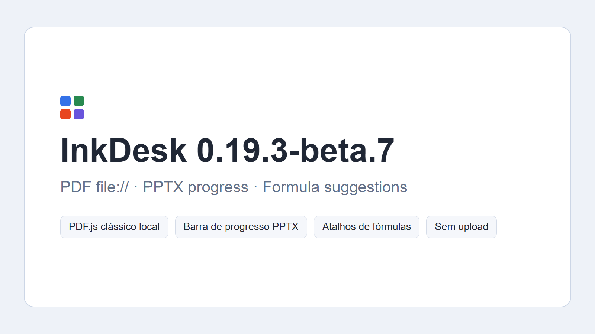

# InkDesk


InkDesk is a local-first browser suite for focused DOCX, XLS/XLSX, PPTX and PDF workflows. It is an experimental compatibility project, not a replacement for Microsoft Office or Microsoft Edge.

## Workspaces

- **Documents** — DOCX opening, basic editing and copy export with section-aware A4 layout, headers, footers and tables. XML parts with a UTF-8 BOM are normalized before parsing.
- **Spreadsheets** — XLS/XLSX opening, basic editing, print-oriented page view and XLSX copy export, with a start screen aligned to the other workspaces.
- **Presentations** — PPTX opening, basic editing, presentation mode and package-preserving copy export.
- **PDF Workspace** — bundled local PDF.js rendering, selectable text, AcroForm controls, synchronized navigation, lazy thumbnails, outline destinations, vertical/horizontal layouts, fullscreen, page-bound review annotations, JSON review export and separate supported PDF saving.



## PDF architecture

The PDF Workspace deliberately combines two layers:

1. the bundled PDF.js worker parses the document and renders canvas, selectable text and supported form layers locally;
2. InkDesk adds navigation and a document-fingerprint review layer for highlights, underlines, marker regions, comments, inserted text and personal bookmarks.

Review items are not silently written into the original PDF. They are stored locally and can be exported as an anonymized InkDesk review JSON sidecar. See [PDF component](docs/PDF_COMPONENT.md) and [known limitations](docs/KNOWN_LIMITATIONS.md).

## Privacy

Files are processed locally. The source tree contains no uploaded clinical or personal reference document. Test fixtures use synthetic content and normalized metadata. PDF review storage is keyed by a content fingerprint and does not persist the original file name. See [Security and privacy](docs/SECURITY_AND_PRIVACY.md).

## Run locally

Open `index.html` directly, or serve the folder with a static web server. Some browser features, including service workers and cross-workspace handoff, are more reliable over HTTP or HTTPS.

## Validate

```bash
npm run validate
npm run audit
npm test
npm run test:release
```

## Release

Current package version: **0.19.3-beta.7**. PDF rendering now uses bundled PDF.js with selectable text, synchronized navigation, real page layers, lazy thumbnails and a five-page canvas window. Spreadsheet interaction now includes drag range selection, formula autocomplete, Excel-style shortcuts and additional local formulas. The package is prepared for manual upload; it does not assert that it was pushed or tagged in Git.

## License

MIT.
